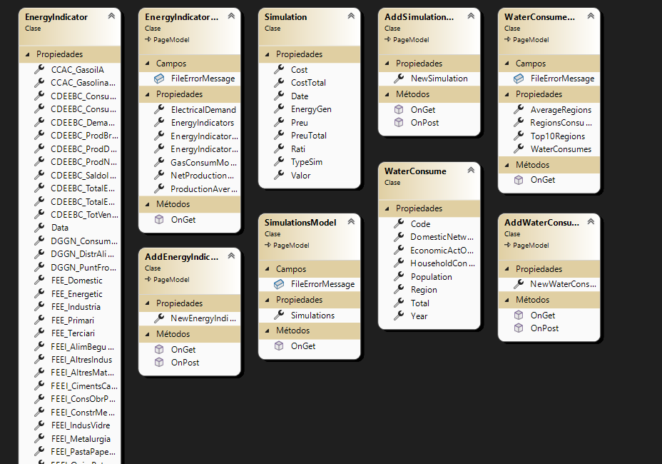
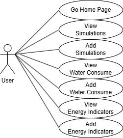

# T4. PR1. Pràctica 1 \- Documentació

# **1. Diagrames**

   S’ha d’explicar cada diagrama (components, relacions, restriccions, multiplicitats, …), no només inserir la imatge.

   1. ## **Diagrama de classes**

   

   Diagrama de classes.

   2. ## **Diagrama de casos d’ús**

   

   El usuari pot interactuar amb la pagina inicial, pot veure les simulacions, afegir simulacions, veure els consums d'aigua, afegir consums d'aigua, veure els indicadors energetics, afegir indicadors energetics.

# **2.  GitHub Project**

   [GitHub Project](https://github.com/users/LlucVelazquez/projects/7)

   Branca ConsumAigua: Aqui es on he implementat la part del consum del aigua, la vista amb la part de afegir amb un formulari i inserir-lo en format .xml.

   Branca EnergyIndicators: Aqui es on he implementat els indicadors energètics, he fet la vista i el formulari per inserir els valors en el fitcher .json.

   Branca Simulacions: Aqui es on he implemntat la vista de les simulacions, i el formulari per inserir-ho en el .csv.

   Branca MinorTaks: Branca que he fet en el final per implementar/millorar en el codi que faltaba, fent tasques petites que m'he habia deixat per fer en les anteriors i corregint errors, codi duplicat i redundant.

# **3. Qualitat**

Codi implemntat per al SonarQube: 
```
name: Build
on:
  push:
    branches:
      - master
  pull_request:
    types: [opened, synchronize, reopened]
jobs:
  sonarqube:
    name: SonarQube
    runs-on: windows-latest
    steps:
      - uses: actions/checkout@v4
        with:
          fetch-depth: 0  # Shallow clones should be disabled for a better relevancy of analysis
      - name: SonarQube Scan
        uses: SonarSource/sonarqube-scan-action@v5
        env:
          SONAR_TOKEN: ${{ secrets.SONAR_TOKEN }}
```
Cada push que es fa a la branca master se executara  una accio per el SonarQube.

# **4. Solució del sistema**

   [Repositori](https://github.com/LlucVelazquez/t4-pr1-LlucVelazquez)

# **5. Testing de la solució**

   S’ha d’incloure una taula amb classes d’equivalència, els casos límit, els casos de prova i la url al projecte de testing unitari amb el framework XUnit (al GitHub).

# **6. Bibliografia**

https://learn.microsoft.com/es-es/dotnet/standard/serialization/system-text-json/how-to

Mohamed Elsakhawy (26/11/2023) How to add new item in JsonFile using C#, deBug.to [link](https://debug.to/6459/how-to-add-new-item-in-jsonfile-using-c)

https://csv-viewer-online.github.io

Ayb4btu (23/10/2015) Read all values from CSV into a List using CsvHelper, stackoverflow [link](https://stackoverflow.com/questions/33294738/read-all-values-from-csv-into-a-list-using-csvhelper)

https://learn.microsoft.com/es-es/dotnet/api/system.xml.xmlreader?view=net-8.0

perplexity.ai (IA) - como leer un xml con xmlreader c#